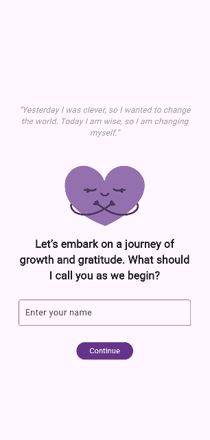
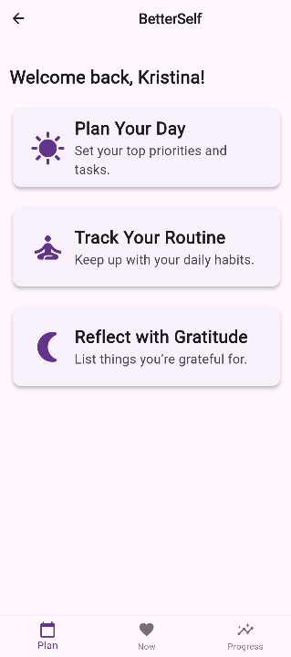
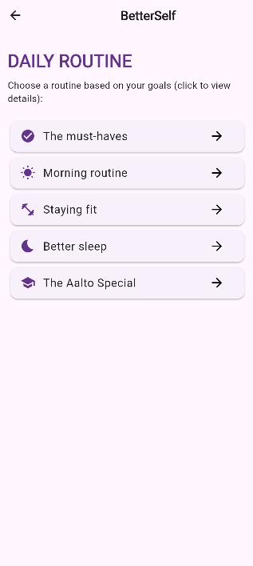
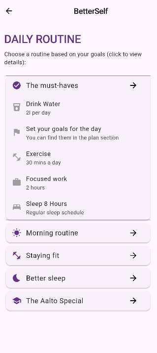
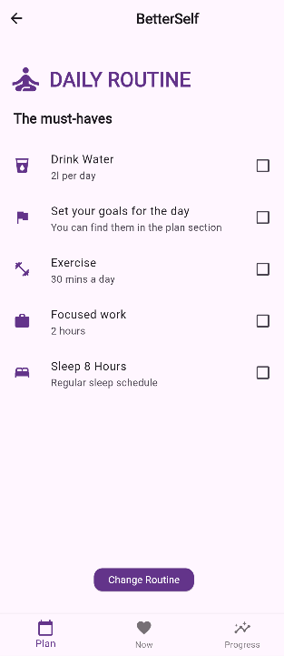
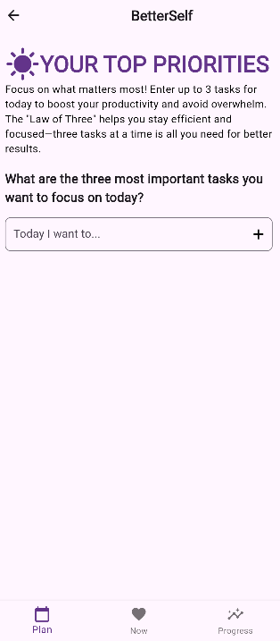
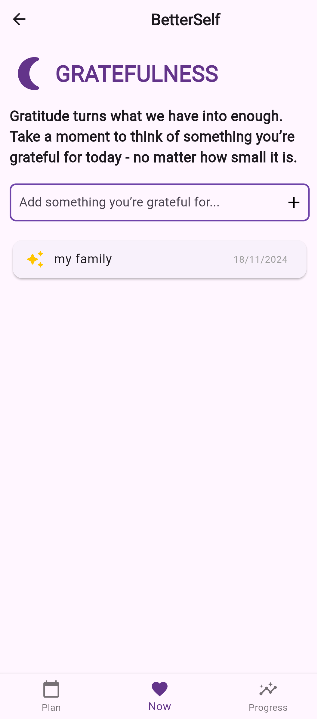
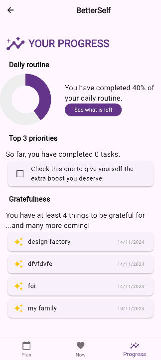
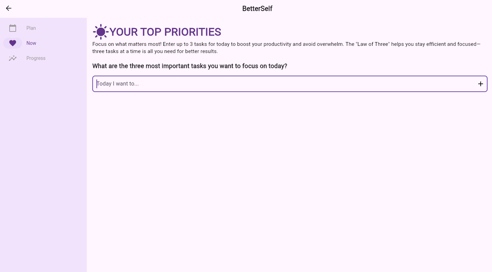
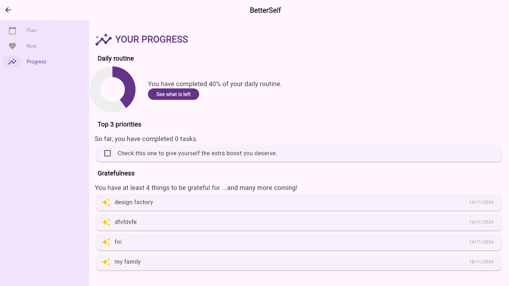

# BetterSelf

## Overview

**BetterSelf** is a self-improvement app designed to help you prioritize daily tasks, track your habits and find a good routine, as well as practice gratitude. It provides a daily planner with several different routines, and a progress tracker, all intended to boost productivity and well-being. The application encourages users to develop better habits by focusing on their top three priorities for the day, maintaining consistent routines, and being grateful every day. The application has been developed as part of the [Device-Agnostic Design Course at Aalto University](https://fitech101.aalto.fi/courses/device-agnostic-design/).

## Purpose

The purpose of BetterSelf is to increase productivity and well-being by providing a structured approach to daily planning. With its features that encourage users to focus on their top three tasks, stay fit, and maintain routines, BetterSelf aims to make achieving personal growth and developing better habits easier. Users are also encouraged to reflect on gratitude, which helps improve mental health and overall positivity.

The application is deployed and available to test here: [BetterSelf App](https://kristinatodorova.github.io/).

## Features

- **Daily Planner**: Helps users set their top three priorities for the day to avoid overwhelm and focus on impactful activities.
- **Routines**: Provides a variety of routines that users can follow, like a morning routine, staying fit, and improving sleep quality.
- **Progress Tracker**: Track the percentage completion of daily routines to stay motivated and on track.
- **Gratitude Journal**: Users can write down things they are grateful for, enhancing positivity and mental well-being.
- **Navigation Adaptability**: The app's navigation adapts to different screen sizes, switching between a bottom navigation bar and a side navigation rail for a more user-friendly experience.

## How to Use

1. **Getting Started**: When first opening the application, you'll be prompted to enter your name and afterwards select a routine from the available choices.

2. **The NOW Tab**: The "Now" Tab will guide you through your day and display a different app feature depending on the current time. In the morning, it will redirect you to the daily planner so you can plan your tasks. In the afternoon, it will display your chosen routine, so you can track your progress during the day. Finally, in the evening it will display the gratitude screen.

3. **Setting Priorities**: The "Plan Your Day" section will ask you to add up to three key tasks for the day. The "Law of Three" is employed to keep you focused without feeling overwhelmed.

4. **Tracking Routines**: You can choose from a set of pre-defined routines that fit your goals (e.g., Morning Routine, Staying Fit). Once selected, you can track your daily progress and see what percentage of the routine you've completed in the Progress tab.

5. **Expressing Gratitude**: At the end of the day, visit the "Gratefulness" section to write down things you are grateful for, helping you reflect positively on your day.

## Screenshots

Below are some screenshots to give you a better understanding of the application interface:

- **Start Screen**

  

- **Plan Screen**

  

- **Routine Picker**

   
  

- **Daily Routine**

  

- **Priorities for the day**

   

- **Gratitude Journal**

  

- **Progress Screen**

  

- **Large Screen Overview**

  
  
  

## Navigation

- The app features adaptive navigation, with a **bottom navigation bar** for mobile devices and a **side navigation rail** for larger screens.
- Click on the icons (e.g., Plan, Now, Progress) to easily navigate through different sections of the application.
